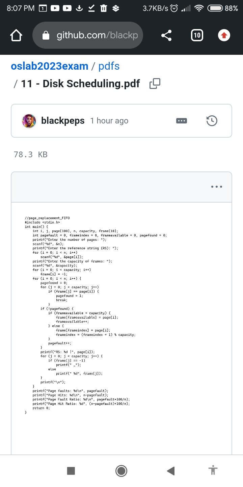
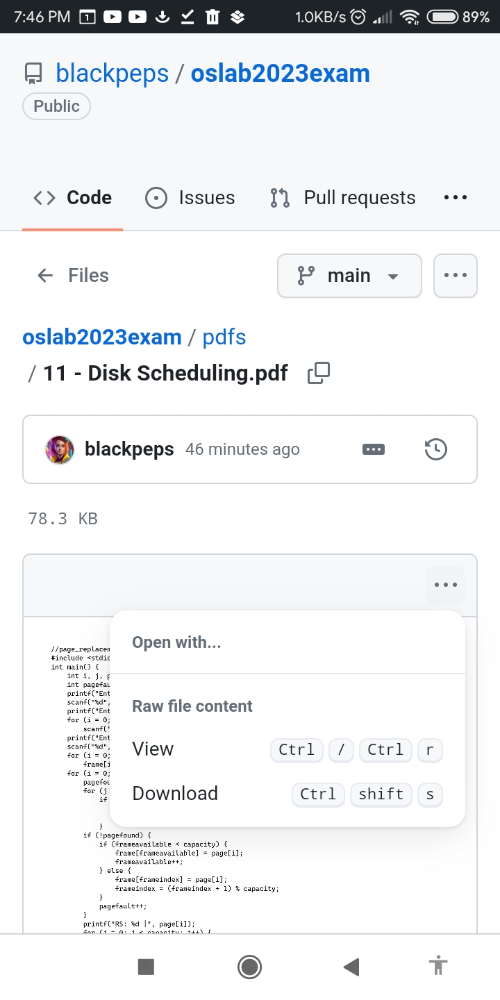

# Operating System Lab (CSL204)

<a name="goback"> </a>

### Table of Contents

| Experiments/Programs                                 | Code                                                                                                       | Download PDF                                                                                                  |
| ---------------------------------------------------- | ---------------------------------------------------------------------------------------------------------- | ------------------------------------------------------------------------------------------------------------- |
| 01 - Familiarisation of Linux Commands               | No Code                                                                                                    | [Download](/01%20-%20Familiarisation%20of%20Linux%20Commands/Linux%20Commands%20and%20Intro%20to%20Shell.pdf) |
| 02 - Shell Programming                               | [Check Subsection](#prgm02)                                                                                | [Download](/pdfs/02%20-%20Shell%20Programming.pdf)                                                            |
| 03 - System Calls                                    | [Check Subsection](#prgm03)                                                                                | [Download](/pdfs/03%20-%20System%20Calls.pdf)                                                                 |
| 04 - I/O System Calls                                | [Code](/04%20-%20IO%20System%20Call/04%20-%20I%20O%20System%20Call.c)                                      | [Download](/pdfs/04%20-%20IO%20System%20Call.pdf)                                                             |
| 05 - Scheduling Algorithms                           | [Check Subsection](#prgm05)                                                                                | [Download](/pdfs/05%20-%20Scheduling%20Algorithms.pdf)                                                        |
| 06 - Inter Process Communication using Shared Memory | [Check Subsection](#prgm06)                                                                                | [Download](/pdfs/06%20-%20Inter%20Process%20Communication%20using%20Shared%20Memory.pdf)                      |
| 07 - IPC using Message Passing (Producer Consumer)   | [Code](</07%20-%20Producer%20Consumer/07%20-%20IPC%20using%20Message%20Passing%20(Producer%20Conusmer).c>) | [Download](/pdfs/07%20-%20Producer%20Consumer.pdf)                                                            |
| 08 - Banker's Algorithm                              | [Code](/08%20-%20Bankers%20Algorithm/08%20-%20Bankers%20Algorithm.c)                                       | [Download](/pdfs/08%20-%20Bankers%20Algorithm.pdf)                                                            |
| 09 - Memory Allocation for Fixed Partition           | [Check Subsection](#prgm09)                                                                                | [Download](/pdfs/09%20-%20Memory%20Management.pdf)                                                            |
| 10 - Page Replacement Algorithms                     | [Check Subsection](#prgm10)                                                                                | [Download](/pdfs/10%20-%20Page%20Replacement.pdf)                                                             |
| 11 - Disk Scheduling Algorithms                      | [Check Subsection](#prgm11)                                                                                | [Download](/pdfs/11%20-%20Disk%20Scheduling.pdf)                                                              |

---

### Getting Error While Clicking Download?

When clicking on "Download", GitHub may lead to a page saying "Error rendering embedded code, Invalid PDF", even though all files are within this [repository](/pdfs/).

#### Solution for Windows, Linux or MacOS Users

If you are using Windows, Linux or MacOS, you can follow the screenshots.

|  |  |
| ----------------------------------------------------- | ----------------------------------------------------- |
| Windows (displaying properly)                         | Solution in Windows for improper display              |

#### Solution for Android Users

If you are using Android (using your phone), follow the steps:

|  |  |
| ---------------------------------------------------- | ---------------------------------------------------- |
| Android displays with no error                       | Downloading the file within Android                  |

---

<a name="prgm02"> </a>

### Shell Programs

| Programs                       | Code                                                                                   |
| ------------------------------ | -------------------------------------------------------------------------------------- |
| 01 - Odd or Even               | [Code](/02%20-%20Shell%20Programming/A%20-%20Odd%20or%20Even.sh)                       |
| 02 - Greatest of Three Numbers | [Code](/02%20-%20Shell%20Programming/B%20-%20Greatest%20of%20Three%20Numbers.sh)       |
| 03 - Factorial of Number       | [Code](/02%20-%20Shell%20Programming/C%20-%20Factorial%20of%20Number.sh)               |
| 04 - Fibonacci Series          | [Code](/02%20-%20Shell%20Programming/D%20-%20Fibonacci%20Series.sh)                    |
| 05 - Calculator                | [Code](</02%20-%20Shell%20Programming/E%20-%20Calculator%20(Using%20Case).sh>)         |
| 06 - Prime number upto a limit | [Code](/02%20-%20Shell%20Programming/F%20-%20Prime%20Number%20upto%20given%20Limit.sh) |

> Notes

You can run shell programs in any number of ways.

```
sh file.sh
```

```
bash files.sh
```

```
./file.sh
```

| [Download](/pdfs/02%20-%20Shell%20Programming.pdf) | [Top](#goback) |
| -------------------------------------------------- | -------------- |

---

<a name="prgm03"> </a>

### System Calls

| Program                  | Code                                                 |
| ------------------------ | ---------------------------------------------------- |
| 01 - Exec()              | [Code](/03%20-%20System%20Calls/A%20-%20Exec.c)      |
| 02 - Fork()              | [Code](/03%20-%20System%20Calls/B%20-%20fork.c)      |
| 03 - getPID()            | [Code](/03%20-%20System%20Calls/C%20-%20getPID.c)    |
| 04 - Stat()              | [Code](/03%20-%20System%20Calls/D%20-%20stat.c)      |
| 05 - Opendir() Readdir() | [Code](/03%20-%20System%20Calls/E%20-%20Directory.c) |
| 06 (a) - Wait()          | [Code](/03%20-%20System%20Calls/F%20-%20wait.c)      |
| 06 (b) - Waits           | [Code](/03%20-%20System%20Calls/F%20-%20waits.c)     |

**Notes before running some programs**

> Note 1

Keep [hello.c](/03%20-%20System%20Calls/A%20-%20hello.c) in the same folder as exec system call file exists.
<br> Then run the following command in the terminal:

```
gcc ./hello.c -o hello
```

followed by compiling your exec system call file as follows:

```
gcc ./exec.c
```

> Note 2

Keep [hello.c](/03%20-%20System%20Calls/A%20-%20hello.c) in the same folder prior to running stat system call. This is required to display the properties of the file hello.c in terminal.

| [Download](/pdfs/03%20-%20System%20Calls.pdf) | [Top](#goback) |
| --------------------------------------------- | -------------- |

---

<a name="prgm05"> </a>

### Scheduling Algorithms

| Program                      | Code                                                                       |
| ---------------------------- | -------------------------------------------------------------------------- |
| 01 - FCFS                    | [Code](/05%20-%20Scheduling%20Algorithms/A%20-%20FCFS.c)                   |
| 02 - SJF                     | [Code](/05%20-%20Scheduling%20Algorithms/B%20-%20SJF.c)                    |
| 03 - Round Robin             | [Code](/05%20-%20Scheduling%20Algorithms/C%20-%20RR.c)                     |
| 04 - SRTF                    | [Code](/05%20-%20Scheduling%20Algorithms/D%20-%20SRTF.c)                   |
| 05 - Preemptive Priority     | [Code](/05%20-%20Scheduling%20Algorithms/E%20-%20Preemptive%20Prio.c)      |
| 06 - Non Preemptive Priority | [Code](/05%20-%20Scheduling%20Algorithms/F%20-%20Non-Preemeptive%20Prio.c) |

| [Alternative Code](/old%20codes/05%20-%20Scheduling%20Algorithms/) | [Download](/pdfs/05%20-%20Scheduling%20Algorithms.pdf) | [Top](#goback) |
| ------------------------------------------------------------------ | ------------------------------------------------------ | -------------- |

---

<a name="prgm06"> </a>

### IPC Using Shared Memory

| Program            | Code                                                                                                                                                                                            |
| ------------------ | ----------------------------------------------------------------------------------------------------------------------------------------------------------------------------------------------- |
| 01 - Shared Memory | [Code 1](/06%20-%20Inter%20Process%20Communication%20using%20Shared%20Memory/A%20-%20shared1.c), [Code 2](/06%20-%20Inter%20Process%20Communication%20using%20Shared%20Memory/A%20-%20shared2.c) |
| 02 - Pipe          | [Code](/06%20-%20Inter%20Process%20Communication%20using%20Shared%20Memory/B%20-%20Pipe.c)                                                                                                      |

> Note

Both the files (Code 1 and Code 2) must be downloaded into the same folder.<br>
Then Code 1 should be compiled and `./a.out` must be executed. (Nothing will happen at that moment). <br>
Then Code 2 should be compiled and `./a.out` must be executed which will display the output. <br>
You can view the output in the following pdf file.

| [Download](/pdfs/06%20-%20Inter%20Process%20Communication%20using%20Shared%20Memory.pdf) | [Top](#goback) |
| ---------------------------------------------------------------------------------------- | -------------- |

---

<a name="prgm09"> </a>

### Memory Allocation Using the Fixed Partition

| Program        | Code                                                        |
| -------------- | ----------------------------------------------------------- |
| 01 - First Fit | [Code](/09%20-%20Memory%20Management/A%20-%20First%20Fit.c) |
| 02 - Best Fit  | [Code](/09%20-%20Memory%20Management/B%20-%20Best%20Fit.c)  |
| 03 - Worst Fit | [Code](/09%20-%20Memory%20Management/C%20-%20Worst%20Fit.c) |

| [Alternative Code](/old%20codes/09%20-%20Memory%20Management/) | [Download](/pdfs/09%20-%20Memory%20Management.pdf) | [Top](#goback) |
| -------------------------------------------------------------- | -------------------------------------------------- | -------------- |

---

<a name="prgm10"> </a>

### Page Replacement Algorithms

| Program   | Code                                                |
| --------- | --------------------------------------------------- |
| 01 - FIFO | [Code](/10%20-%20Page%20Replacement/A%20-%20fifo.c) |
| 02 - LRU  | [Code](/10%20-%20Page%20Replacement/B%20-%20lru.c)  |
| 03 - LFU  | [Code](/10%20-%20Page%20Replacement/C%20-%20lfu.c)  |

| [Alternative Code](/old%20codes/10%20-%20Page%20Replacement/) | [Download](/pdfs/10%20-%20Page%20Replacement.pdf) | [Top](#goback) |
| ------------------------------------------------------------- | ------------------------------------------------- | -------------- |

---

<a name="prgm09"> </a>

### Disk Scheduling

| Program     | Code                                                |
| ----------- | --------------------------------------------------- |
| 01 - FCFS   | [Code](/11%20-%20Disk%20Scheduling/A%20-%20FCFS.c)  |
| 02 - SCAN   | [Code](/11%20-%20Disk%20Scheduling/B%20-%20SCAN.c)  |
| 03 - C-SCAN | [Code](/11%20-%20Disk%20Scheduling/C%20-%20CSCAN.c) |

| [Alternative Code](/old%20codes/11%20-%20Disk%20Scheduling/) | [Download](/pdfs/11%20-%20Disk%20Scheduling.pdf) | [Top](#goback) |
| ------------------------------------------------------------ | ------------------------------------------------ | -------------- |

---
